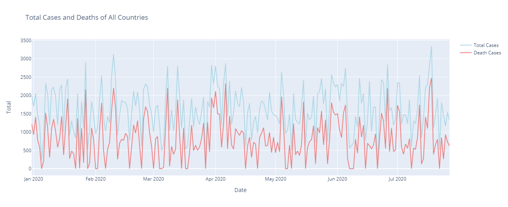
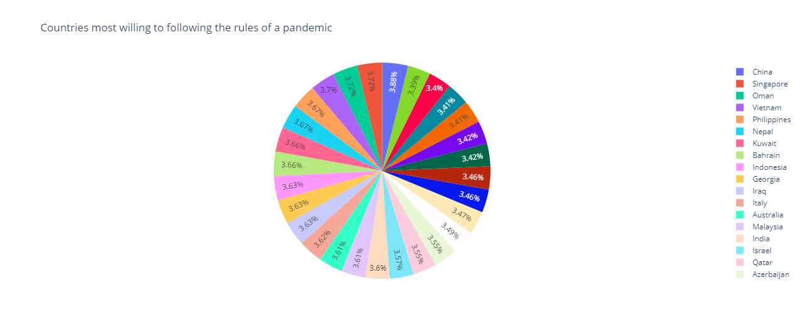
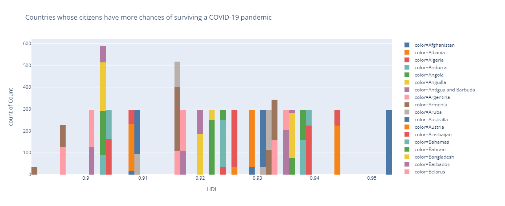
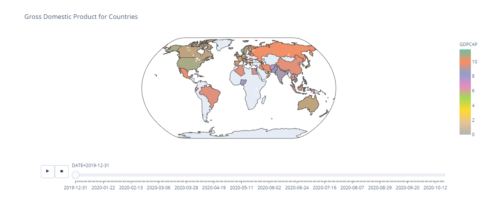
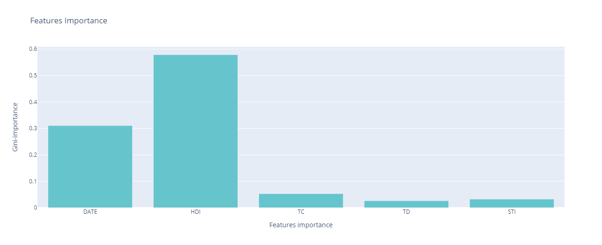
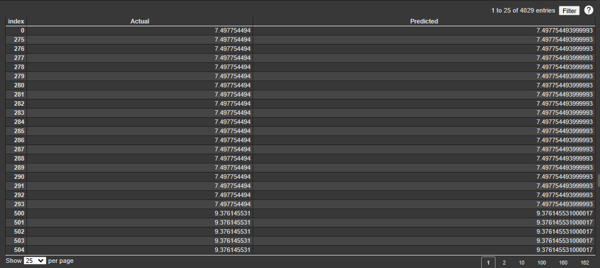

# Impact of Covid-19 Pandemic on the Global Economy Machine Learning using LinearRgression, DecisionTreeRegression , XGBoostRegression, and RandomForestRegression
<li><a href="#Data">Dataset Link</a></li>
<li><a href="#Installation">Installation</a></li>
<li><a href="#Business Problem">Business Problem</a></li>
<li><a href="#EDA">Exploratory Data Analysis</a></li>
<li><a href="#Results">Results</a></li>
<li><a href="#Resources">Resources</a></li>
<li><a href="#Author">Author</a></li>

# Dataset Link:
The dataset is [here](https://www.kaggle.com/shashwatwork/impact-of-covid19-pandemic-on-the-global-economy)

# Installation:
Python versions 3.*.

Libraries:
- [Pandas](https://pandas.pydata.org/)
- [Numpy](https://numpy.org/)
- [Scikit-learn](https://scikit-learn.org/stable/)
- [Plotly](https://plotly.com/)
- [Matplotlib](https://matplotlib.org/stable/index.html)

# Business Problem:
In this project, I will use Machine learning models such as  `LinearRgression`, `DecisionTreeRegression`, `XGBoostRegression`, and `RandomForestRegression` to predict the impact of Covid-19 on the global economy especially on GDP per capita on the global economy and the impact of unexpected pandemics on GDP and the extent of their impact on citizens. GDP is one of the most important economic indicators; it shows the short-term development of an economy.

# Exploratory Data Analysis:

- Total Cases and Deaths changing rapidly.
- China most willing to following the rules of a pandemic.
- Afghanistan has more chances of surviving a Covid-19 pandemic than other countries.
- Gross Domestic Product changing rapidly, in end of 2019 Norway has the highest Gross Domestic Product and in October of 2020 changed to become Brunei the highest.

**Chart 1:**

**Chart 2:**

**Chart 3:**

**Chart 4:**

# Results:

In this project I used the Impact of Covid-19 Pandemic on the Global Economy to predict Gross Domestic Product (GDP) per capita in each country. I determine GDPCAP as a target column. The data contains continues values, so I used the regression models. Also I used supervised learning, to create a model by using labeled training data.
Then I plot some charts to understand and analysis which is about:
Correlation heatmap to extract relationships between columns
- Total and deaths cases
- Distribution of Countries most willing to following the rules of a pandemic
- Distribution of Countries whose citizens have more chances of surviving a COVID-19 pandemic
- Distribution of Population in each country
- Distribution of Gross Domestic Product (GDP) for countries

After that I extract the five features importance from correlation heatmap and they were `HDI`, `TC`, `TD`, `STI`, `POP`. Then I applied with first model and it was `LinearRgression` I get accuracy **31.49%** and mean squared error was **6.97** the outcomes it is so bad so I tried with another model to get good results. The second model was `DecisionTreeRegression` the accuracy is **99.89%** and mean squared error was **0.01** it is a great result. Third model is `XGBoostRegression` the accuracy **95.10%** and mean squared error was **0.50** better than LinearRgression and worse than `DecisionTreeRegression`. Last model it was `RandomForestRegressor` and the accuracy in this model was **99.97%** as for the mean squared error it was **0.00** the best results. Based on the results I obtained, I can say the `RandomForestRegressor` the best model for the data it has the highest accuracy **99.97%** and lowest mean squared error **0.00**. 

Then, I have compared all models with `Baseline` model and I found the accuracy was the worst **11%**, it is not a good result.
Furthermore, I visualize chart automatically displays the features importance associated with the target column GDPCAP. Then, I try again in RandomForestRegressor with the most important column in features importance I got it from the plot and it was `HDI`. `HDI` and `GDP` columns have a strong relationship, each one influencing the other that means when `HDI` increases, the `GDP` will also increase, and vice versa.

This chart shows us Features importance in `RandomForestRegression` model

When I used just one feature importance I obtained an accuracy **65.36%** and mean squared error was **3.61**, it is not a good result, so five features importance is better than one feature importance. After that, I compared between actual and predicted data for each models, I found that `RandomForestRegressor` made the best predictions reasonably close to actual data, while `LinearRgression` made the worst predictions it is working outside the scope of `LinearRgression`.

This chart shows us a comparison between actual and pridected data in `RandomForestRegression` model

Finally, I used RandomizedSearchCV to get the best parameters and I preferred it on grid search. It is similar to grid search, and yet it has proven to yield better results comparatively. I used it on the `RandomForestRegressor` for one feature importance column to get best parameters because I did not get a good accuracy as I got it before with the features importance. 
Note: I only extracted the most important parameters, and Colab with GPU did not help me to apply it.

# Resources:
* [The Economic Impact of COVID-19: Positives and Negatives](https://www.visualcapitalist.com/economic-impact-covid-19/)
* [10 tricks for a better Google Colab experience](https://towardsdatascience.com/10-tips-for-a-better-google-colab-experience-33f8fe721b82#34af)
* [Annotated Heatmaps in Python](https://plotly.com/python/annotated-heatmap/)
* [Choropleth Maps in Python](https://plotly.com/python/choropleth-maps/)
* [Introducing Plotly Express](https://medium.com/plotly/introducing-plotly-express-808df010143d)
* [Data Visualization in Python](https://towardsdatascience.com/the-next-level-of-data-visualization-in-python-dd6e99039d5e)
* [2D Histograms with Plotly](https://towardsdatascience.com/2d-histograms-with-plotly-a5ef9370e02d)
* [Linear Regression](http://www.stat.yale.edu/Courses/1997-98/101/linreg.htm)
* [What is Linear Regression](https://www.statisticssolutions.com/what-is-linear-regression/)
* [Using XGBoost in Python](https://www.datacamp.com/community/tutorials/xgboost-in-python)
* [XGBoost for Regression](https://www.geeksforgeeks.org/xgboost-for-regression/)
* [Random Forest Regression](https://levelup.gitconnected.com/random-forest-regression-209c0f354c84)
* [Decision Tree vs. Random Forest – Which Algorithm Should you Use?](https://www.analyticsvidhya.com/blog/2020/05/decision-tree-vs-random-forest-algorithm/)
*[Decision Trees and Random Forests](https://jakevdp.github.io/PythonDataScienceHandbook/05.08-random-forests.html)
* [Python | Decision Tree Regression using sklearn](https://www.geeksforgeeks.org/python-decision-tree-regression-using-sklearn/)
* [Always start with a stupid model, no exceptions](https://blog.insightdatascience.com/always-start-with-a-stupid-model-no-exceptions-3a22314b9aaa)
* [Mapping column names to random forest feature importances](https://stackoverflow.com/questions/41900387/mapping-column-names-to-random-forest-feature-importances)
* [The Mathematics of Decision Trees, Random Forest and Feature Importance in Scikit-learn and Spark](https://towardsdatascience.com/the-mathematics-of-decision-trees-random-forest-and-feature-importance-in-scikit-learn-and-spark-f2861df67e3)
* [How to find optimal parameters using RandomizedSearchCV for Regression?](https://www.dezyre.com/recipes/find-optimal-parameters-using-randomizedsearchcv-for-regression)

# Author:
Bedoor Alharbi

