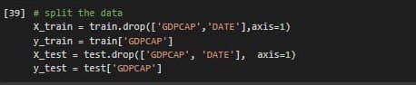
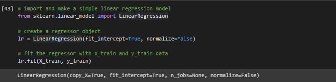
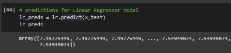
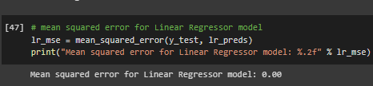
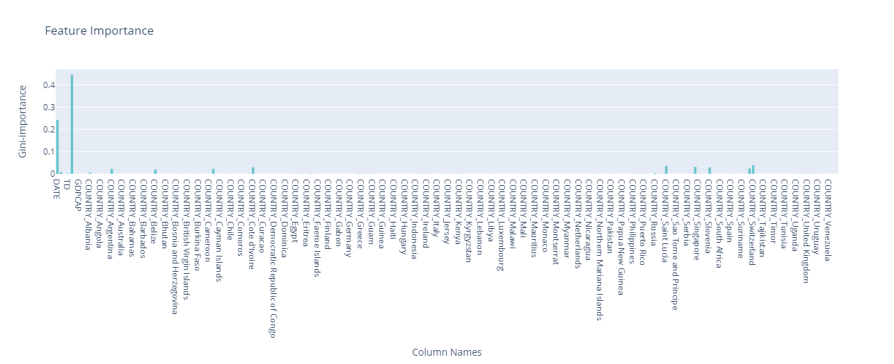

# Impact of Covid-19 Pandemic on the Global Economy Machine Learning
<li><a href="#Introduction">Introduction</a></li>
<li><a href="#Data">Dataset Link</a></li>
<li><a href="#Installation">Installation</a></li>
<li><a href="#Business Problem">Business Problem</a></li>
<li><a href="#EDA">Exploratory Data Analysis</a></li>
<li><a href="#Results">Results</a></li>
<li><a href="#Resources">Resources</a></li>
<li><a href="#Author">Author</a></li>

## Introduction:
The global pandemic has disrupted business activities worldwide. But COVID-19’s economic impact has varied across regions, and the consequences have been largely dependent on a regions are economic position. I will use Machine learning models such as  `LinearRgression`, `DecisionTreeRegression`, `XGBoostRegression`, and `RandomForestRegression` to predict impact Covid-19 on Gross Domestic Product (GDP) per capita.

## Dataset Link:
The dataset is [here](https://www.kaggle.com/shashwatwork/impact-of-covid19-pandemic-on-the-global-economy)

## Installation:
Python versions 3.*.

Libraries:
- [Pandas](https://pandas.pydata.org/)
- [Numpy](https://numpy.org/)
- [Scikit-learn](https://scikit-learn.org/stable/)
- [Plotly](https://plotly.com/)
- [Matplotlib](https://matplotlib.org/stable/index.html)

## Business Problem:
Predicting the impact of Covid-19 on the global economy especially on GDP per capita on the global economy and the impact of unexpected pandemics on GDP and the extent of their impact on citizens. GDP is one of the most important economic indicators; it shows the short-term development of an economy.

# Exploratory Data Analysis:

- Total Cases and Deaths changing rapidly.
- China most willing to following the rules of a pandemic.
- Afghanistan has more chances of surviving a Covid-19 pandemic than other countries.

**Chart 1:**

**Chart 2:**

**Chart 3:**

# Results:

In this project I used the Impact of Covid-19 Pandemic on the Global Economy to predict Gross Domestic Product (GDP) per capita in each country. I determine GDPCAP as a target column. The data contains continues values, so I used the regression models. Also I used supervised learning, to create a model by using labeled training data.
Then I plot some charts to understand and analysis which is about:
Correlation heatmap to extract relationships between columns
- Total and deaths cases
- Distribution of Countries most willing to following the rules of a pandemic
- Distribution of Countries whose citizens have more chances of surviving a COVID-19 pandemic
- Distribution of Population in each country
- Distribution of Gross Domestic Product (GDP) for countries

Then I applied some models which corresponds to the data I have. I used `LinearRgression` , `DecisionTreeRegression` , `XGBoostRegression` , and `RandomForestRegressor` 

Here, I’ll create the x and y variables by taking them from the dataset and splitting it manually into training and test sets.

Fit the model
I am going to use x_train and y_train obtained above to train my regression model. I am using the fit method and passing the parameters as shown below.

Note that the output of this cell is describing a number of parameters like copy_X, fit_intercept, etc. for the model. The parameters will change depending on the model chosen.

Predict using the trained model
Once the model is trained, it’s ready to make predictions. We can use the predict method on the model and pass x_test as a parameter to get the output as y_pred.

I need to check to see how well my model is performing on the test data. For this, I evaluate my model by finding the mean squared error produced by the model. 
Mean squared error is a built in function, and we are using NumPy’s mean squared error function (mean_squared_error)

Furthermore, I visualize chart automatically displays the feature importance associated with the target column **GDPCAP** for the models. In `DecisionTreeRegression` and `RandomForestRegressor` the feature importance was DATE by 0.24, STI by 0.45, COUNTRY_Switzerland by 0.4, COUNTRY_Saint Lucia by 0.37, COUNTRY_Sierra Leone by 0.34. in `LinearRgression` does not support feature importance. `XGBoostRegression` has different feature importance it was `DATE`, `STI`, `COUNTRY_Switzerland`, `COUNTRY_Saint Lucia`, `TC`
This chart shows us Feature importance in `RandomForestRegression` and `DecisionTreeRegression` models

After that, I compared between actual and predicted data for each models, I found that `DecisionTreeRegression` made the best predictions reasonably close to actual data, while `LinearRgression` made the worst predictions it is working outside the scope of `LinearRgression`.

This chart shows us a comparison between actual and predicted data in `DecisionTreeRegression` model

Finally, I found that mean squared error in `LinearRgression` was **0.00**, in `DecisionTreeRegression` was **0.00**, in `XGBoostRegression` was **0.47**, and in RandomForestRegressor **0.04**. As we can see, `LinearRgression` and `DecisionTreeRegression` they have no errors. The score in `LinearRgression`, `DecisionTreeRegression`, `XGBoostRegression`, and `RandomForestRegressor` recorded score with **99.98%**, **100%**, **95.54%**, and **99.66%**. As we see, `DecisionTreeRegression` model has the highest score.
Then, I have compared all models with `Baseline` model and I found the score was the worst **11%**, it is not a good result.

# Resources:
* [The Economic Impact of COVID-19: Positives and Negatives](https://www.visualcapitalist.com/economic-impact-covid-19/)
* [10 tricks for a better Google Colab experience](https://towardsdatascience.com/10-tips-for-a-better-google-colab-experience-33f8fe721b82#34af)
* [Annotated Heatmaps in Python](https://plotly.com/python/annotated-heatmap/)
* [Choropleth Maps in Python](https://plotly.com/python/choropleth-maps/)
* [Introducing Plotly Express](https://medium.com/plotly/introducing-plotly-express-808df010143d)
* [Data Visualization in Python](https://towardsdatascience.com/the-next-level-of-data-visualization-in-python-dd6e99039d5e)
* [2D Histograms with Plotly](https://towardsdatascience.com/2d-histograms-with-plotly-a5ef9370e02d)
* [Linear Regression](http://www.stat.yale.edu/Courses/1997-98/101/linreg.htm)
* [What is Linear Regression](https://www.statisticssolutions.com/what-is-linear-regression/)
* [Using XGBoost in Python](https://www.datacamp.com/community/tutorials/xgboost-in-python)
* [XGBoost for Regression](https://www.geeksforgeeks.org/xgboost-for-regression/)
* [Random Forest Regression](https://levelup.gitconnected.com/random-forest-regression-209c0f354c84)
* [Decision Tree vs. Random Forest – Which Algorithm Should you Use?](https://www.analyticsvidhya.com/blog/2020/05/decision-tree-vs-random-forest-algorithm/)
*[Decision Trees and Random Forests](https://jakevdp.github.io/PythonDataScienceHandbook/05.08-random-forests.html)
* [Python | Decision Tree Regression using sklearn](https://www.geeksforgeeks.org/python-decision-tree-regression-using-sklearn/)
* [Always start with a stupid model, no exceptions](https://blog.insightdatascience.com/always-start-with-a-stupid-model-no-exceptions-3a22314b9aaa)
* [Mapping column names to random forest feature importances](https://stackoverflow.com/questions/41900387/mapping-column-names-to-random-forest-feature-importances)
* [The Mathematics of Decision Trees, Random Forest and Feature Importance in Scikit-learn and Spark](https://towardsdatascience.com/the-mathematics-of-decision-trees-random-forest-and-feature-importance-in-scikit-learn-and-spark-f2861df67e3)
* [How to find optimal parameters using RandomizedSearchCV for Regression?](https://www.dezyre.com/recipes/find-optimal-parameters-using-randomizedsearchcv-for-regression)

# Author:
Bedoor Alharbi

